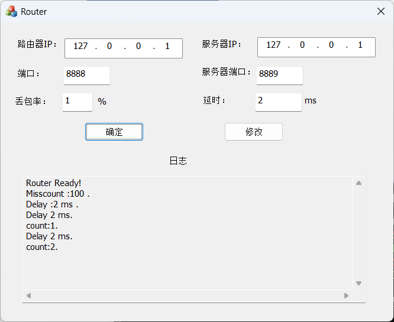
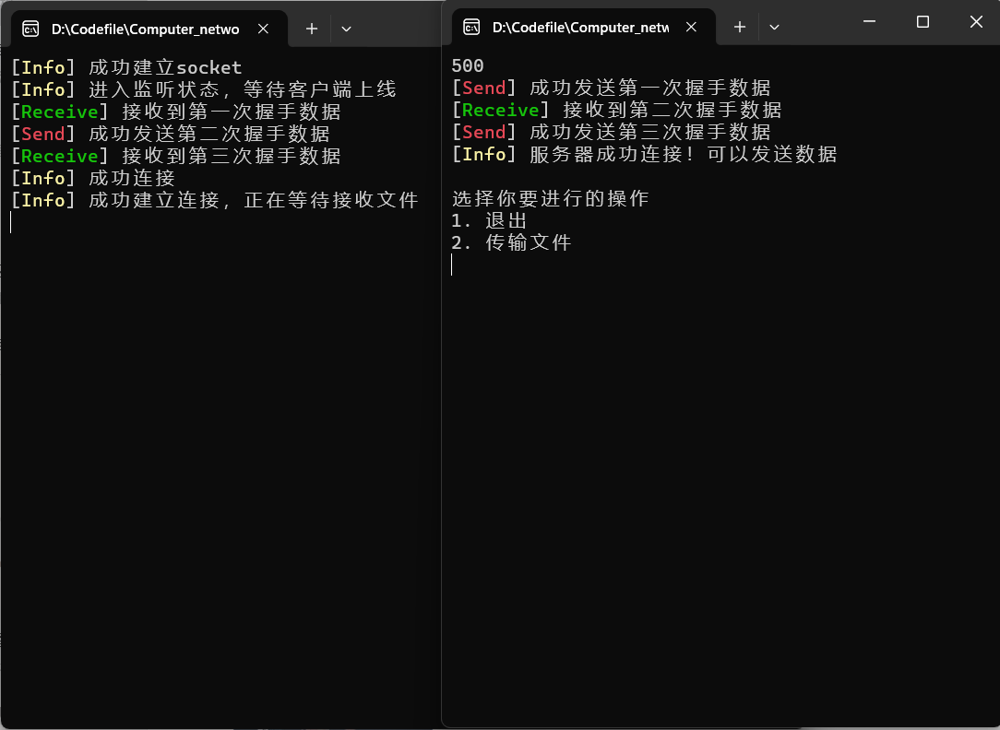
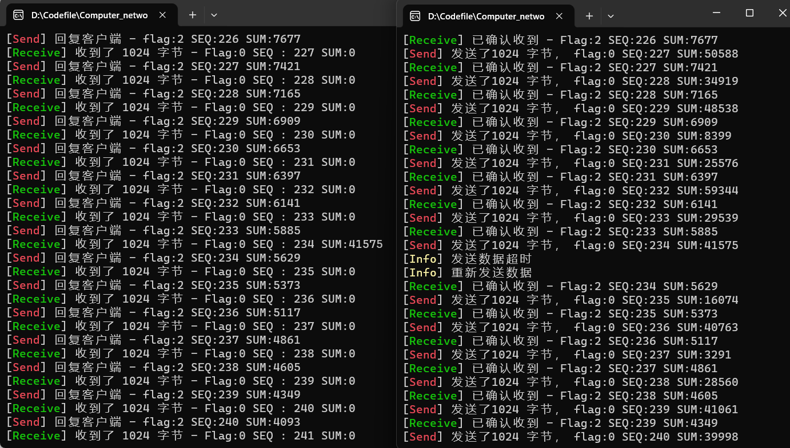
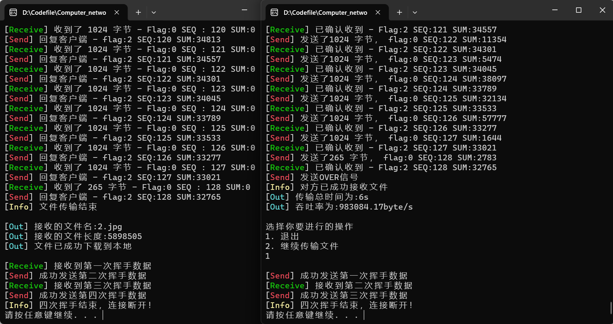
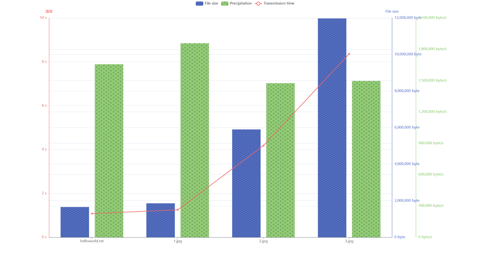

# 计算机网络实验报告

<center>Lab3-1 基于UDP服务设计可靠传输协议并编程实现</center>

<center>网络空间安全学院 物联网工程</center>

<center>2110951 梁晓储</center>

代码已发布到github：https://github.com/WangshuXC/Computer_network

## 一、实验要求

1. 实现单向数据传输（一端发数据，一端返回确认）。

2. 对于每个任务要求给出详细的协议设计。

3. 完成给定测试文件的传输，显示传输时间和平均吞吐率。

4. 性能测试指标：吞吐率、延时，给出图形结果并进行分析。

5. 完成详细的实验报告（每个任务完成一份，主要包含自己的协议设计、实现方法、遇到的问题、实验结果，不要抄写太多的背景知识）。

6. 编写的程序应该结构清晰，具有较好的可读性。

7. 提交程序源码、可执行文件和实验报告。


## 二、协议设计和实验流程

### Header协议设计

在send.cpp和receive.cpp中定义一个结构体`HEADER` ，其中包含如下信息。

```cpp
struct HEADER
{
    u_short sum = 0;
    u_short datasize = 0;
    unsigned char flag = 0;
    unsigned char SEQ = 0;
    HEADER() {
        sum = 0;
        datasize = 0;
        flag = 0;
        SEQ = 0;
    }
};
```

每次发送packet需要修改header中的信息时修改该全局数组，再将其加入sendBuf。

- `sum`:16位的校验和
- `datasize`:所包含数据长度 16位
- `flag`:8位，使用后三位，排列是 FIN ACK SYN
- `SEQ`:8位，传输的序列号，0~255，超过后 mod


flag:

```c++
const unsigned char SYN = 0x1;
// 001—— FIN = 0 ACK = 0 SYN = 1

const unsigned char ACK = 0x2;
// 010—— FIN = 0 ACK = 1 SYN = 0

const unsigned char ACK_SYN = 0x3;
// 011—— FIN = 0 ACK = 1 SYN = 1

const unsigned char FIN = 0x4;
// 100—— FIN = 1 ACK = 0 SYN = 0

const unsigned char FIN_ACK = 0x5;
// 101—— FIN = 1 ACK = 0 SYN = 1

const unsigned char OVER = 0x7;
// 结束标志 111—— FIN = 1 ACK = 1 SYN = 1
```


### 实验流程

1.   **三次握手建立连接：**
     - 发送端发送第一次握手（SYN）。
     - 接收端接收第一次握手，并发送第二次握手（ACK）。
     - 发送端接收第二次握手，并发送第三次握手（ACK_SYN）。
2.   **文件数据传输：**
     - 发送端发送文件数据，每个数据包都有一个 `HEADER` 头部，包含校验和、数据长度、标志位等信息。
     - 接收端接收文件数据，对每个数据包进行校验和验证，如果校验和正确，发送确认 ACK 给发送端，表示成功接收数据。
3.   **四次挥手断开连接：**
     - 接收端发送第一次挥手（FIN）。
     - 发送端接收第一次挥手，并发送第二次挥手（ACK）。
     - 接收端接收第二次挥手，并发送第三次挥手（ACK）。
     - 发送端接收第三次挥手，并发送第四次挥手（FIN_ACK）。


## 三、功能实现和代码分析

### 差错检测实现

差错校验是通过计算校验和来实现的。具体来说，校验和是在每个数据包的`HEADER`结构中计算得出的一个值，用于检测数据在传输过程中是否发生了错误或丢失。

在发送数据包之前，通过`send_package`函数将数据按照指定长度和顺序号组织成`HEADER`结构。然后，在计算校验和之前，先将校验和字段置为0。接下来，对`HEADER`结构中的所有成员变量（包括数据、数据长度、标志位和序列号）进行逐位异或（XOR）运算，最终得到校验和的值。将这个计算得到的校验和写入`HEADER`结构的校验和字段中。

当接收端收到数据包时，它会重新计算接收到的数据包的校验和。如果计算得到的校验和与接收到的数据包中的校验和相等，说明数据在传输过程中没有发生错误或丢失。如果两者不相等，则表示数据包可能存在差错，需要进行处理。

```cpp
u_short checkSum(u_short* mes, int size) {
    int count = (size + 1) / 2;
    u_short* buf = (u_short*)malloc(size + 1);
    memset(buf, 0, size + 1);
    memcpy(buf, mes, size);

    u_long sum = 0;
    while (count--) {
        sum += *buf++;
        if (sum & 0xffff0000) {
            sum &= 0xffff;
            sum++;
        }
    }
    return ~(sum & 0xffff);
}
```


### 三次握手实现

#### 发送端

```c++
int Connect(SOCKET& socketClient, SOCKADDR_IN& servAddr, int& servAddrlen) // 三次握手建立连接
{
    HEADER header;
    char* Buffer = new char[sizeof(header)];

    // 第一次握手
    header.flag = SYN;
    header.sum = 0; // 校验和置0
    // 计算校验和
    header.sum = checkSum((u_short*)&header, sizeof(header));
    // 将数据头放入buffer
    memcpy(Buffer, &header, sizeof(header));
    if (sendto(socketClient, Buffer, sizeof(header), 0, (sockaddr*)&servAddr, servAddrlen) == -1)
    {
        return -1;
    }
    else
    {
        cout << "[\033[1;31mSend\033[0m] 成功发送第一次握手数据" << endl;
    }
    clock_t start = clock(); // 记录发送第一次握手时间

    // 设置socket为非阻塞状态
    u_long mode = 1;
    ioctlsocket(socketClient, FIONBIO, &mode);

    // 第二次握手
    while (recvfrom(socketClient, Buffer, sizeof(header), 0, (sockaddr*)&servAddr, &servAddrlen) <= 0)
    {
        // 超时需要重传
        if (clock() - start > MAX_TIME) // 超时，重新传输第一次握手
        {
            cout << "[\033[1;33mInfo\033[0m] 第一次握手超时" << endl;
            header.flag = SYN;
            header.sum = 0;                                            // 校验和置0
            header.sum = checkSum((u_short*)&header, sizeof(header)); // 计算校验和
            memcpy(Buffer, &header, sizeof(header));                   // 将数据头放入Buffer
            sendto(socketClient, Buffer, sizeof(header), 0, (sockaddr*)&servAddr, servAddrlen);
            start = clock();
            cout << "[\033[1;33mInfo\033[0m] 已经重传" << endl;
        }
    }

    // 第二次握手，收到来自接收端的ACK
    // 进行校验和检验
    memcpy(&header, Buffer, sizeof(header));
    if (header.flag == ACK && checkSum((u_short*)&header, sizeof(header)) == 0)
    {
        cout << "[\033[1;32mReceive\033[0m] 接收到第二次握手数据" << endl;
    }
    else
    {
        cout << "[\033[1;33mInfo\033[0m] 错误数据，请重试" << endl;
        return -1;
    }

    // 进行第三次握手
    header.flag = ACK_SYN;
    header.sum = 0;
    header.sum = checkSum((u_short*)&header, sizeof(header)); // 计算校验和
    if (sendto(socketClient, (char*)&header, sizeof(header), 0, (sockaddr*)&servAddr, servAddrlen) == -1)
    {
        return -1;
    }
    else
    {
        cout << "[\033[1;31mSend\033[0m] 成功发送第三次握手数据" << endl;
    }
    cout << "[\033[1;33mInfo\033[0m] 服务器成功连接！可以发送数据" << endl;
    return 1;
}
```

函数的作用是发送第一次握手数据，等待接收端的第二次握手数据，并发送第三次握手数据。

函数首先创建一个包含握手信息的数据头`HEADER`。然后将数据头放入缓冲区`Buffer`中，并通过`sendto`函数发送给服务器端。如果发送失败，返回-1；否则打印成功发送的消息。

接下来，将发送端的套接字`socketClient`设置为非阻塞模式。然后进入一个循环，不断尝试接收接收端的第二次握手数据。如果接收超时（超过最大时间限制），则重新发送第一次握手数据。如果接收成功，将接收到的数据拷贝到数据头`header`中，检查其合法性。如果数据正确且校验和正确，打印成功接收的消息；否则返回-1。

最后，发送第三次握手数据给接收端，并打印成功发送的消息。函数返回1表示成功建立连接。


#### 接收端

```c++
int Connect(SOCKET& sockServ, SOCKADDR_IN& ClientAddr, int& ClientAddrLen)
{
    HEADER header;
    char* Buffer = new char[sizeof(header)];

    // 接收第一次握手信息
    while (1)
    {
        // 通过绑定的socket传递、接收数据
        if (recvfrom(sockServ, Buffer, sizeof(header), 0, (sockaddr*)&ClientAddr, &ClientAddrLen) == -1)
        {
            return -1;
        }
        memcpy(&header, Buffer, sizeof(header));
        if (header.flag == SYN && checkSum((u_short*)&header, sizeof(header)) == 0)
        {
            cout << "[\033[1;32mReceive\033[0m] 接收到第一次握手数据 " << endl;
            break;
        }
    }
    // 发送第二次握手信息
    header.flag = ACK;
    header.sum = 0;
    header.sum = checkSum((u_short*)&header, sizeof(header));
    memcpy(Buffer, &header, sizeof(header));

    if (sendto(sockServ, Buffer, sizeof(header), 0, (sockaddr*)&ClientAddr, ClientAddrLen) == -1)
    {
        return -1;
    }
    else
    {
        cout << "[\033[1;31mSend\033[0m] 成功发送第二次握手数据 " << endl;
    }
    clock_t start = clock(); // 记录第二次握手发送时间

    // 接收第三次握手
    while (recvfrom(sockServ, Buffer, sizeof(header), 0, (sockaddr*)&ClientAddr, &ClientAddrLen) <= 0)
    {
        // 超时重传
        if (clock() - start > MAX_TIME)
        {
            cout << "[\033[1;33mInfo\033[0m] 第二次握手超时 " << endl;
            header.flag = ACK;
            header.sum = 0;
            header.flag = checkSum((u_short*)&header, sizeof(header));
            memcpy(Buffer, &header, sizeof(header));
            if (sendto(sockServ, Buffer, sizeof(header), 0, (sockaddr*)&ClientAddr, ClientAddrLen) == -1)
            {
                return -1;
            }
            cout << "[\033[1;33mInfo\033[0m] 已经重传 " << endl;
        }
    }

    // 解析收到的第三次握手的数据包
    HEADER temp1;
    memcpy(&temp1, Buffer, sizeof(header));

    if (temp1.flag == ACK_SYN && checkSum((u_short*)&temp1, sizeof(temp1)) == 0)
    {
        cout << "[\033[1;32mReceive\033[0m] 接收到第三次握手数据" << endl;
        cout << "[\033[1;33mInfo\033[0m] 成功连接" << endl;
    }
    else
    {
        cout << "[\033[1;33mInfo\033[0m] 错误数据，请重试" << endl;
    }
    return 1;
}
```

函数的作用是接收客户端的第一次握手数据，发送第二次握手数据，并等待接收发送端的第三次握手数据。

函数首先创建一个包含握手信息的数据头`HEADER`。然后进入一个循环，通过`recvfrom`函数不断尝试接收发送端的第一次握手数据。如果接收成功，将接收到的数据拷贝到数据头`header`中，检查其合法性。如果数据正确且校验和正确，打印成功接收的消息；否则返回-1。

接下来，发送第二次握手数据给发送端。将数据头放入缓冲区`Buffer`中，并通过`sendto`函数发送给发送端。如果发送失败，返回-1；否则打印成功发送的消息。

然后，进入一个循环，不断尝试接收发送端的第三次握手数据。如果接收超时（超过最大时间限制），则重新发送第二次握手数据。如果接收成功，将接收到的数据拷贝到临时数据头`temp1`中，检查其合法性。如果数据正确且校验和正确，打印成功接收的消息，并打印成功连接的消息；否则打印错误数据的消息。

最后，函数返回1表示成功建立连接。


### 文件传输

在连接（握手）完毕后，会进入到文件传输的过程。

#### 发送端

发送端有关文件传输的函数是send()和send_package()，大致步骤如下：

1. 创建HEADER实例并填充相应信息，同时分配一个长度为 `MAXSIZE + sizeof(header)` 字节的缓冲区 `buffer`，用于存储整个数据包（包括头部和实际数据）。

   ```cpp
   HEADER header;
   char* buffer = new char[MAXSIZE + sizeof(header)];
   header.datasize = len;
   header.SEQ = unsigned char(order);//序列号
   memcpy(buffer, &header, sizeof(header));//将计算好校验和的header重新赋值给buffer，此时的buffer可以发送了
   memcpy(buffer + sizeof(header), message, len);//buffer为header+message
   header.sum = checksum((u_short*)buffer, sizeof(header) + len);//计算校验和
   ```

2.   发送文件名和文件大小给接收端

     ```cpp
     //发送
     sendto(socketClient, buffer, len + sizeof(header), 0, (sockaddr*)&servAddr, servAddrlen);
     cout << "[\033[1;31mSend\033[0m] 发送了" << len << " 字节，"
              << " flag:" << int(header.flag)
              << " SEQ:" << int(header.SEQ) << " SUM:" << int(header.sum) << endl;
     clock_t start = clock();//记录发送时间
     ```
     
3.   发送文件数据（包含超时重传处理）

     -   将套接口状态改为非阻塞模式，通过 `ioctlsocket` 函数将 `FIONBIO` 参数设为 1，这样 `recvfrom` 函数在没有数据可读时不会阻塞程序的执行，而是立即返回。
     -   进入一个无限循环，尝试通过 `recvfrom` 函数接收对方发送的数据包。如果接收失败（返回值小于等于0），说明可能是由于超时导致的，此时会进行超时重传。
     -   如果超时，则重新设置要发送的数据包（设置数据长度、序列号、标志位等），计算新的校验和，并通过 `sendto` 函数重新发送数据包。
     -   如果接收成功，则将接收到的数据包解析到 `header` 结构体中，并检查确认信息的合法性。条件判断中检查了校验和是否为零、序列号是否匹配、标志位是否为 ACK。
     -   如果确认信息合法，输出一些信息表示成功接收到确认信息，并退出循环，将套接口状态改回阻塞模式，否则继续下一轮循环。
     
     ```cpp
     //接收ack等信息
     while (1)
     {
         u_long mode = 1;
         ioctlsocket(socketClient, FIONBIO, &mode);//将套接口状态改为非阻塞
     
     
         while (recvfrom(socketClient, buffer, MAXSIZE, 0, (sockaddr*)&servAddr, &servAddrlen) <= 0) {
             //超时重传
             if (clock() - start > MAX_TIME)
             {
                 cout << "[\033[1;33mInfo\033[0m] 发送数据超时" << endl;
                 header.datasize = len;
                 header.SEQ = u_char(order);//序列号
                 header.flag = u_char(0x0);
                 memcpy(buffer, &header, sizeof(header));
                 memcpy(buffer + sizeof(header), message, sizeof(header) + len);
                 u_short check = checksum((u_short*)buffer, sizeof(header) + len);//计算校验和
                 header.sum = check;
                 memcpy(buffer, &header, sizeof(header));
                 sendto(socketClient, buffer, len + sizeof(header), 0, (sockaddr*)&servAddr, servAddrlen);//发送
                 cout << "[\033[1;33mInfo\033[0m] 重新发送数据" << endl;
                 start = clock();//记录发送时间
             }
             else break;
         }
         memcpy(&header, buffer, sizeof(header));//缓冲区接收到信息，放入header，此时header中是收到的数据
         //u_short check = cksum((u_short*)&header, sizeof(header));
         if (checksum((u_short*)&header, sizeof(header)) == 0 && header.SEQ == u_short(order) && header.flag == ACK)
         {
             cout << "[\033[1;32mReceive\033[0m] 已确认收到 - Flag:" << int(header.flag)
                      << " SEQ:" << int(header.SEQ) << " SUM:" << int(header.sum) << endl;
             break;
         }
         else
         {
             continue;
         }
     }
     u_long mode = 0;
     ioctlsocket(socketClient, FIONBIO, &mode);//改回阻塞模式
     ```

4. 发送结束信息

   ```cpp
   //发送结束信息
   HEADER header;
   char* Buffer = new char[sizeof(header)];
   header.flag = OVER;
   header.sum = checksum((u_short*)&header, sizeof(header));
   memcpy(Buffer, &header, sizeof(header));
   sendto(socketClient, Buffer, sizeof(header), 0, (sockaddr*)&servAddr, servAddrlen);
   cout << "[\033[1;31mSend\033[0m] 发送OVER信号" << endl;
   clock_t start = clock();
   while (1)
   {
       //超时重传，同上
       //...
   }
   u_long mode = 0;
   ioctlsocket(socketClient, FIONBIO, &mode);//改回阻塞模式
   ```


#### 接收端

接收端接受文件的函数是RecvMessage()，大致步骤如下：

1. 接受文件大小，分配缓冲区。

   ```cpp
   long int fileLength = 0;//文件长度
   HEADER header;
   char* Buffer = new char[MAXSIZE + sizeof(header)];
   int seq = 0;
   int index = 0;
   ```

2. 接收文件数据

   - 使用 `recvfrom` 函数接收数据包，其中 `sockServ` 是套接字，`Buffer` 是接收数据的缓冲区，`sizeof(header) + MAXSIZE` 是期望接收的数据包的最大长度，`0` 是接收数据的标志，`ClientAddr` 和 `ClientAddrLen` 是保存发送方地址信息的参数。
   - 判断接收到的数据包的标志位和校验和是否满足预期条件。如果接收到的标志位是结束标志 `OVER` 且校验和为零，则表示文件传输结束，退出循环。
   - 如果接收到的标志位为零（可能是数据包），并且校验和满足预期条件，继续处理。
   - 检查序列号是否正确。如果序列号不正确，说明接收到的数据包可能出错，需要重新返回确认信息（ACK）给发送方。在此处，它会重新发送上一个回复包的确认信息。
   - 如果序列号正确，将接收到的数据包的信息存储到缓冲区 `message` 中，同时更新文件长度和序列号。
   - 返回确认信息（ACK）给发送方，表示成功接收到数据包。
   - 继续接收下一个数据包。

   ```cpp
       while (1)
       {
           int length = recvfrom(sockServ, Buffer, sizeof(header) + MAXSIZE, 0, (sockaddr *)&ClientAddr, &ClientAddrLen); // 接收报文长度
           // cout << length << endl;
           memcpy(&header, Buffer, sizeof(header));
           // 判断是否是结束
           if (header.flag == OVER && checkSum((u_short *)&header, sizeof(header)) == 0)
           {
               cout << "[\033[1;33mInfo\033[0m] 文件传输结束" << endl;
               break;
           }
           if (header.flag == static_cast<unsigned char>(0) && checkSum((u_short *)Buffer, length - sizeof(header)))
           {
               // 如果收到的序列号出错，则重新返回ACK，此时seq没有变化
               if (checkSum((u_short *)Buffer, length - sizeof(header)) == 0 && seq != int(header.SEQ))
               {
                   //说明出了问题，返回ACK
                   header.flag = ACK;
                   header.datasize = 0;
                   header.SEQ = (unsigned char)seq;
                   header.sum = checkSum((u_short*)&header, sizeof(header));
                   memcpy(Buffer, &header, sizeof(header));
                   //重发该包的ACK
                   sendto(sockServ, Buffer, sizeof(header), 0, (sockaddr*)&ClientAddr, ClientAddrLen);
                   cout << "[\033[1;33mInfo\033[0m]重发上一个回复包 - ACK:" << (int)header.SEQ << " SEQ:" << (int)header.SEQ << endl;
                   continue; // 丢弃该数据包
               }
               seq = int(header.SEQ);
               if (seq > 255)
               {
                   seq = seq - 256;
               }
   
               cout << "[\033[1;32mReceive\033[0m] 收到了 " << length - sizeof(header) << " 字节 - Flag:" << int(header.flag) << " SEQ : " << int(header.SEQ) << " SUM:" << int(header.sum) << endl;
               char *temp = new char[length - sizeof(header)];
               memcpy(temp, Buffer + sizeof(header), length - sizeof(header));
               // cout << "size" << sizeof(message) << endl;
               memcpy(message + fileLength, temp, length - sizeof(header));
               fileLength = fileLength + int(header.datasize);
   
               // 返回ACK
               header.flag = ACK;
               header.datasize = 0;
               header.SEQ = (unsigned char)seq;
               header.sum = 0;
               header.sum = checkSum((u_short *)&header, sizeof(header));
               memcpy(Buffer, &header, sizeof(header));
               // 返回客户端ACK，代表成功收到了
               sendto(sockServ, Buffer, sizeof(header), 0, (sockaddr *)&ClientAddr, ClientAddrLen);
               cout << "[\033[1;31mSend\033[0m] 回复客户端 - flag:" << (int)header.flag << " SEQ:" << (int)header.SEQ << " SUM:" << int(header.sum) << endl;
               seq++;
               if (seq > 255)
               {
                   seq = seq - 256;
               }
           }
       }
   ```

3. 发送OVER信息并返回文件长度

   ```cpp
   //发送OVER信息
   header.flag = OVER;
   header.sum = 0;
   header.sum = checkSum((u_short*)&header, sizeof(header));
   memcpy(Buffer, &header, sizeof(header));
   if (sendto(sockServ, Buffer, sizeof(header), 0, (sockaddr*)&ClientAddr, ClientAddrLen) == -1)
   {
       return -1;
   }
   return fileLength;
   ```


### 实现四次挥手

#### 发送端

```cpp
int disConnect(SOCKET &socketClient, SOCKADDR_IN &servAddr, int &servAddrlen)
{
    HEADER header;
    char *Buffer = new char[sizeof(header)];

    u_short sum;

    // 进行第一次挥手
    header.flag = FIN;
    header.sum = 0;                                         // 校验和置0
    header.sum = cksum((u_short *)&header, sizeof(header)); // 计算校验和
    memcpy(Buffer, &header, sizeof(header));                // 将首部放入缓冲区
    if (sendto(socketClient, Buffer, sizeof(header), 0, (sockaddr *)&servAddr, servAddrlen) == -1)
    {
        return -1;
    }
    else
    {
        cout << "[\033[1;31mSend\033[0m] 成功发送第一次挥手数据" << endl;
    }
    clock_t start = clock(); // 记录发送第一次挥手时间

    u_long mode = 1;
    ioctlsocket(socketClient, FIONBIO, &mode); // FIONBIO为命令，允许1/禁止0套接口s的非阻塞1/阻塞0模式。

    // 接收第二次挥手
    while (recvfrom(socketClient, Buffer, sizeof(header), 0, (sockaddr *)&servAddr, &servAddrlen) <= 0)
    {
        // 超时，重新传输第一次挥手
        if (clock() - start > MAX_TIME)
        {
            cout << "[\033[1;33mInfo\033[0m] 第一次挥手超时" << endl;
            header.flag = FIN;
            header.sum = 0;                                         // 校验和置0
            header.sum = cksum((u_short *)&header, sizeof(header)); // 计算校验和
            memcpy(Buffer, &header, sizeof(header));                // 将首部放入缓冲区
            sendto(socketClient, Buffer, sizeof(header), 0, (sockaddr *)&servAddr, servAddrlen);
            start = clock();
            cout << "[\033[1;33mInfo\033[0m] 已重传第一次挥手数据" << endl;
        }
    }

    // 进行校验和检验
    memcpy(&header, Buffer, sizeof(header));
    if (header.flag == ACK && cksum((u_short *)&header, sizeof(header) == 0))
    {
        cout << "[\033[1;32mReceive\033[0m] 接收到第二次挥手数据" << endl;
    }
    else
    {
        cout << "[\033[1;33mInfo\033[0m] 错误数据，请重试" << endl;
        return -1;
    }

    // 进行第三次挥手
    header.flag = FIN_ACK;
    header.sum = 0;
    header.sum = cksum((u_short *)&header, sizeof(header)); // 计算校验和
    if (sendto(socketClient, (char *)&header, sizeof(header), 0, (sockaddr *)&servAddr, servAddrlen) == -1)
    {
        return -1;
    }
    else
    {
        cout << "[\033[1;31mSend\033[0m] 成功发送第三次挥手数据" << endl;
    }
    start = clock();
    // 接收第四次挥手
    while (recvfrom(socketClient, Buffer, sizeof(header), 0, (sockaddr *)&servAddr, &servAddrlen) <= 0)
    {
        if (clock() - start > MAX_TIME) // 超时，重新传输第三次挥手
        {
            cout << "[\033[1;33mInfo\033[0m] 第三次挥手超时" << endl;
            header.flag = FIN;
            header.sum = 0;                                         // 校验和置0
            header.sum = cksum((u_short *)&header, sizeof(header)); // 计算校验和
            memcpy(Buffer, &header, sizeof(header));                // 将首部放入缓冲区
            sendto(socketClient, Buffer, sizeof(header), 0, (sockaddr *)&servAddr, servAddrlen);
            start = clock();
            cout << "[\033[1;33mInfo\033[0m] 已重传第三次挥手数据" << endl;
        }
    }
    cout << "[\033[1;33mInfo\033[0m] 四次挥手结束，连接断开！" << endl;
    return 1;
}
```

函数首先构造并发送第一次挥手数据，然后设置socket为非阻塞模式，并在超时情况下重新传输第一次挥手数据。

接着进行校验和检验，如果通过则发送第三次挥手数据，并等待接收服务端的第四次挥手数据，同样在超时情况下重新传输第三次挥手数据。

最后输出四次挥手结束的信息，表示连接已经成功断开。


#### 接收端

```c++
int disConnect(SOCKET &sockServ, SOCKADDR_IN &ClientAddr, int &ClientAddrLen)
{
    HEADER header;
    char *Buffer = new char[sizeof(header)];
    while (1)
    {
        int length = recvfrom(sockServ, Buffer, sizeof(header) + MAXSIZE, 0, (sockaddr *)&ClientAddr, &ClientAddrLen); // 接收报文长度
        memcpy(&header, Buffer, sizeof(header));
        if (header.flag == FIN && checkSum((u_short *)&header, sizeof(header)) == 0)
        {
            cout << "[\033[1;32mReceive\033[0m] 接收到第一次挥手数据 " << endl;
            break;
        }
        else
        {
            return -1;
        }
    }
    // 发送第二次挥手信息
    header.flag = ACK;
    header.sum = 0;
    header.sum = checkSum((u_short *)&header, sizeof(header));
    memcpy(Buffer, &header, sizeof(header));
    if (sendto(sockServ, Buffer, sizeof(header), 0, (sockaddr *)&ClientAddr, ClientAddrLen) == -1)
    {
        cout << "[\033[1;33mInfo\033[0m] 发送第二次挥手失败" << endl;
        return -1;
    }
    else
    {
        cout << "[\033[1;33mInfo\033[0m] 成功发送第二次挥手数据" << endl;
    }
    clock_t start = clock(); // 记录第二次挥手发送时间

    // 接收第三次挥手
    while (recvfrom(sockServ, Buffer, sizeof(header), 0, (sockaddr *)&ClientAddr, &ClientAddrLen) <= 0)
    {
        // 发送第二次挥手等待第三次挥手过程中超时，重传第二次挥手
        if (clock() - start > MAX_TIME)
        {
            cout << "[\033[1;33mInfo\033[0m] 第二次挥手超时 " << endl;
            header.flag = ACK;
            header.sum = 0;
            header.sum = checkSum((u_short *)&header, sizeof(header));
            memcpy(Buffer, &header, sizeof(header));
            if (sendto(sockServ, Buffer, sizeof(header), 0, (sockaddr *)&ClientAddr, ClientAddrLen) == -1)
            {
                return -1;
            }
            cout << "[\033[1;33mInfo\033[0m] 已重传第二次挥手数据 " << endl;
        }
    }
    // 解析收到的第三次挥手
    HEADER temp1;
    memcpy(&temp1, Buffer, sizeof(header));
    if (temp1.flag == FIN_ACK && checkSum((u_short *)&temp1, sizeof(temp1) == 0))
    {
        cout << "[\033[1;33mInfo\033[0m] 接收到第三次挥手数据 " << endl;
    }
    else
    {
        cout << "[\033[1;33mInfo\033[0m] 错误数据，请重试" << endl;
        return -1;
    }

    // 发送第四次挥手信息
    header.flag = FIN_ACK;
    header.sum = 0;
    header.sum = checkSum((u_short *)&header, sizeof(header));
    memcpy(Buffer, &header, sizeof(header));
    if (sendto(sockServ, Buffer, sizeof(header), 0, (sockaddr *)&ClientAddr, ClientAddrLen) == -1)
    {
        cout << "[\033[1;33mInfo\033[0m] 第四次挥手发送失败 " << endl;
        return -1;
    }
    else
    {
        cout << "[\033[1;31mSend\033[0m] 成功发送第四次挥手数据 " << endl;
    }
    cout << "[\033[1;33mInfo\033[0m] 四次挥手结束，连接断开！ " << endl;
    return 1;
}
```

函数首先接收客户端的第一次挥手数据，然后发送第二次挥手数据，并等待接收客户端的第三次挥手数据，同样在超时情况下重新传输第二次挥手数据。

接着解析客户端的第三次挥手数据，如果通过校验则发送第四次挥手数据，最后输出四次挥手结束的信息，表示连接已经成功断开。


### 计算传输时间和吞吐率

该过程是在发送端中完成的

```c++
send(server, severAddr, len, (char *)(inputFile.c_str()), inputFile.length());
clock_t start1 = clock();
send(server, severAddr, len, buffer, i);
clock_t end1 = clock();

cout << "[\033[1;36mOut\033[0m] 传输总时间为:" << (end1 - start1) / CLOCKS_PER_SEC << "s" << endl;
cout << "[\033[1;36mOut\033[0m] 吞吐率为:" << fixed << setprecision(2) << (((double)i) / ((end1 - start1) / CLOCKS_PER_SEC)) << "byte/s" << endl;
```

首先分别在发送文件内容前后运用clock函数记录两次时间。

然后用第二个clock函数调用返回的时间减去第一个clock函数调用返回的时间，并除以CLOCKS_PER_SEC（每秒钟的时钟周期数），得到传输时间。

最后，通过将文件大小除以传输时间来得到吞吐率，同时我为了数据的精准，使用了fixed和setprecision函数来设置输出的小数位数。


## 实验结果展示

### 路由器设置



### 三次握手建立连接



### 丢包后实现超时重传



### 输出传输时间和吞吐率，四次挥手断开连接



## 性能测试指标

对三个文件进行传输测试（未经过路由）

|     文件名     |   文件大小   | 传输时间 |      吞吐率      |
| :------------: | :----------: | :------: | :--------------: |
| helloworld.txt | 1655808byte  |  1.08s   | 1655808.00byte/s |
|     1.jpg      | 1857353byte  |  1.25s   | 1857353.00byte/s |
|     2.jpg      | 5898505byte  |  4.18s   | 1474626.25byte/s |
|     3.jpg      | 11968994byte |  8.36s   | 1496124.25byte/s |

图表结果如下



