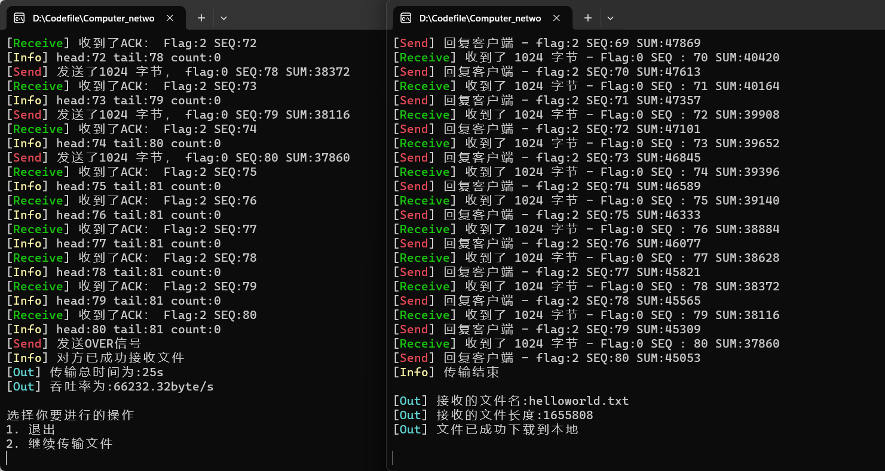
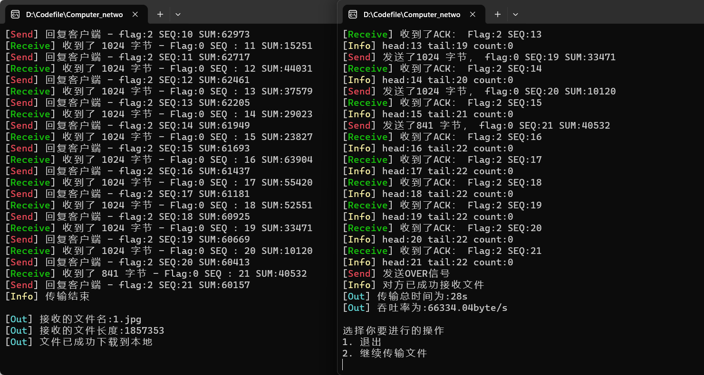
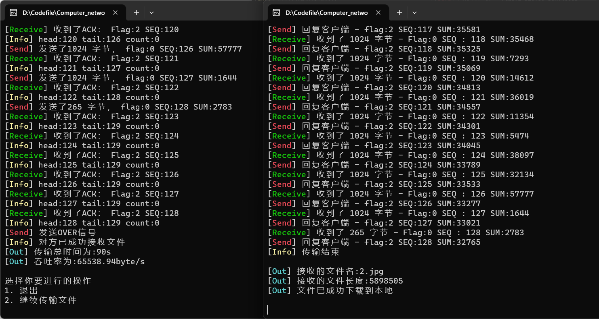
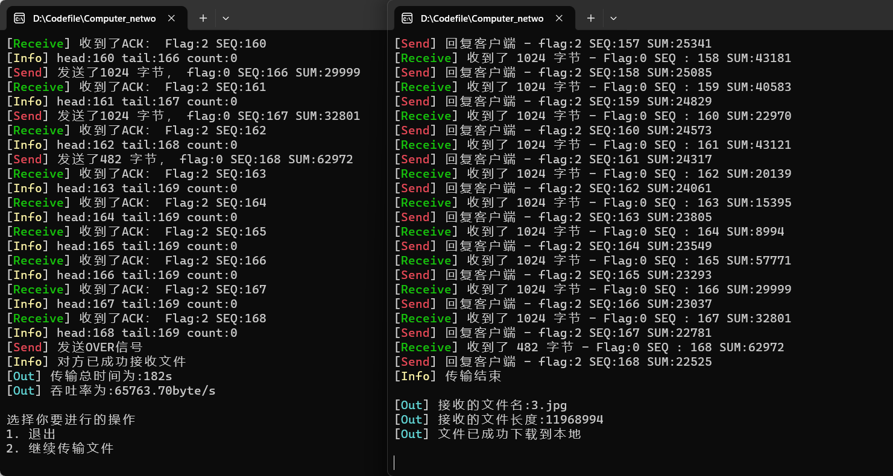
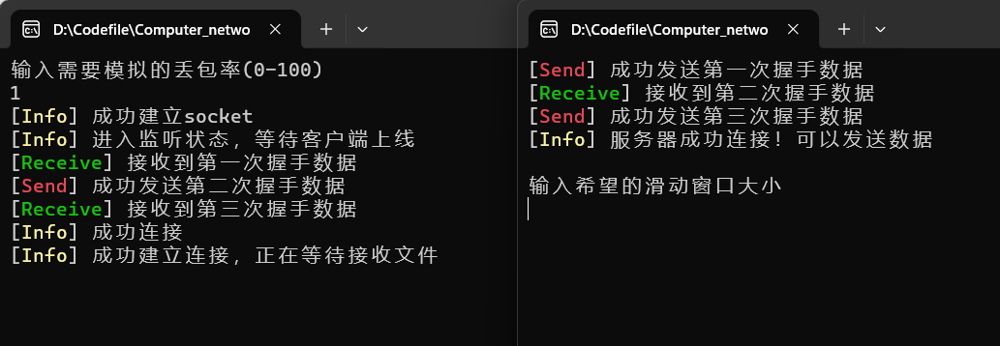
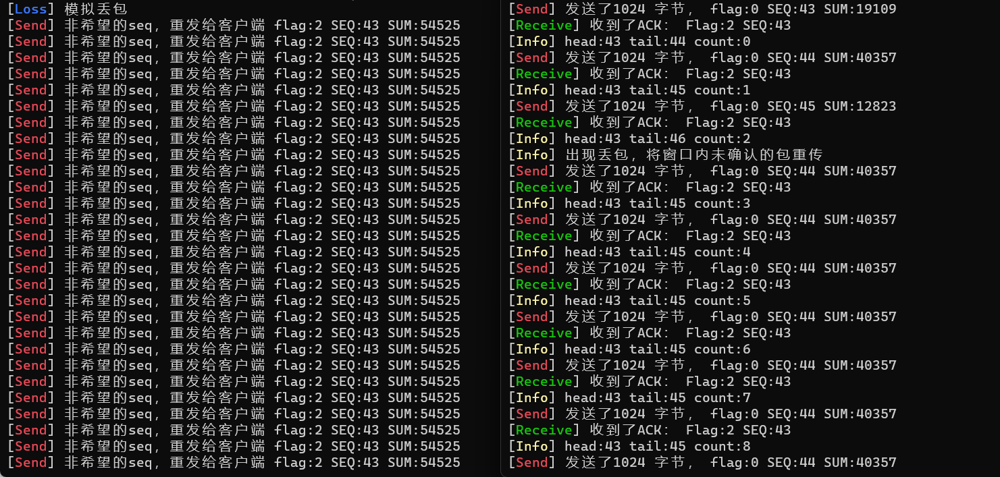
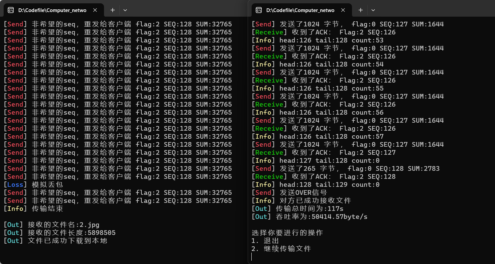
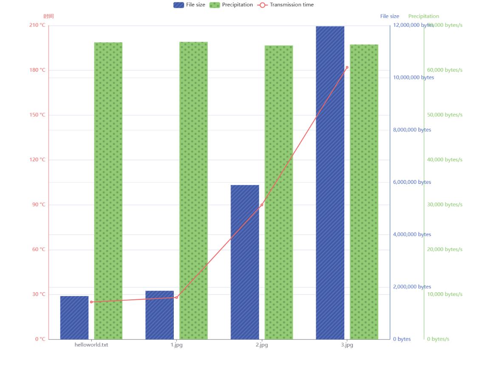

# 计算机网络实验报告

<center>Lab3-2 基于UDP服务设计可靠传输协议并编程实现</center>

<center>网络空间安全学院 物联网工程</center>

<center>2110951 梁晓储</center>

代码已发布到github：https://github.com/WangshuXC/Computer_network

## 一、实验要求

1. 实现单向数据传输（一端发数据，一端返回确认）。

2. 对于每个任务要求给出详细的协议设计。

3. 完成给定测试文件的传输，显示传输时间和平均吞吐率。

4. 性能测试指标：吞吐率、延时，给出图形结果并进行分析。

5. 完成详细的实验报告（每个任务完成一份，主要包含自己的协议设计、实现方法、遇到的问题、实验结果，不要抄写太多的背景知识）。

6. 编写的程序应该结构清晰，具有较好的可读性。

7. 提交程序源码、可执行文件和实验报告。

8. 在实验3-1的基础上，将停等机制改成基于滑动窗口的流量控制机制，发送窗口和接收窗口采用相同大小，支持累积确认，完成给定测试文件的传输。


## 二、协议设计和实验流程

### Header协议设计

在send.cpp和receive.cpp中定义一个结构体`HEADER` ，其中包含如下信息。

```cpp
struct HEADER
{
    u_short sum = 0;
    u_short datasize = 0;
    unsigned char flag = 0;
    unsigned char SEQ = 0;
    HEADER() {
        sum = 0;
        datasize = 0;
        flag = 0;
        SEQ = 0;
    }
};
```

每次发送packet需要修改header中的信息时修改该全局数组，再将其加入sendBuf。

- `sum`:16位的校验和
- `datasize`:所包含数据长度 16位
- `flag`:8位，使用后三位，排列是 FIN ACK SYN
- `SEQ`:8位，传输的序列号，0~255，超过后 mod


flag:

```c++
const unsigned char SYN = 0x1;
// 001—— FIN = 0 ACK = 0 SYN = 1

const unsigned char ACK = 0x2;
// 010—— FIN = 0 ACK = 1 SYN = 0

const unsigned char ACK_SYN = 0x3;
// 011—— FIN = 0 ACK = 1 SYN = 1

const unsigned char FIN = 0x4;
// 100—— FIN = 1 ACK = 0 SYN = 0

const unsigned char FIN_ACK = 0x5;
// 101—— FIN = 1 ACK = 0 SYN = 1

const unsigned char OVER = 0x7;
// 结束标志 111—— FIN = 1 ACK = 1 SYN = 1
```


### GBN协议说明

首先建立窗口，以windows为10为例，定义head为窗口头，tail为窗口尾，当收到的seq大于现有head的值（不可能大于tail的值）且没有seq的溢出更新情况时，把head移动到收到的ack包的seq处，通过以下上方红色框中的代码实现窗口的滑动（如果收到的seq比head大很多则直接滑动到seq处）；如果收到的seq为因为溢出更新过的seq，则需要+256再进行处理

```c++
if (int(header.SEQ) >= head % 256)
{
    //收到的ACK序列号等于当前已确认的最大序列号，表示这是一条重复的确认信息，需要进行计数处理
    if (int(header.SEQ) == head % 256)
    {
        count++;
    }
    else
    {   
        count = 0;
    }

    head = head + int(header.SEQ) - head % 256;

    cout << "[\033[1;32mReceive\033[0m] 收到了ACK： Flag:" << int(header.flag)
        << " SEQ:" << int(header.SEQ) << endl;

    cout << "[\033[1;33mInfo\033[0m] head:" << head % 256 << ' ' << "tail:" << tail % 256;
    cout << " count:" << count << endl;
    if (count == 2)
    {
        tail = head + 1;
        cout << "[\033[1;33mInfo\033[0m] 出现丢包，将窗口内未确认的包重传" << endl;
    }
    else if (count > 2)
    {
        tail = head + 1;
    }
}
//如果接收到的ACK序列号小于窗口大小，但跨越了序列号环，需要更新缓冲区头部
else if (head % 256 > 256 - WINDOWS - 1 && int(header.SEQ) < WINDOWS)
{
    head = head + 256 - head % 256 + int(header.SEQ);
    cout << "[\033[1;32mReceive\033[0m] 收到了ACK（跨seq）：Flag:" << int(header.flag)
        << " SEQ:" << int(header.SEQ) << endl;
}
```

代码中通过两条代码进行窗口滑动

```c++
head = head + int(header.SEQ) - head % 256;

head = head + 256 - head % 256 + int(header.SEQ);
```

如果出现错误，如校验和出错或者丢包或者超时，则`tail = head + 1`，通过此条命令清空除了head之后的窗口中未确认的数据包，将从head往后的所有数据包重新打包通过while循环依次发送，实现“回退N步”

### 实验流程

1.   **三次握手建立连接：**
     - 发送端发送第一次握手（SYN）。
     - 接收端接收第一次握手，并发送第二次握手（ACK）。
     - 发送端接收第二次握手，并发送第三次握手（ACK_SYN）。
2.   **文件数据传输：**
     - 发送端发送文件数据，每个数据包都有一个 `HEADER` 头部，包含校验和、数据长度、标志位等信息。
     - 接收端接收文件数据，对每个数据包进行校验和验证，如果校验和正确，发送确认 ACK 给发送端，表示成功接收数据。
3.   **四次挥手断开连接：**
     - 接收端发送第一次挥手（FIN）。
     - 发送端接收第一次挥手，并发送第二次挥手（ACK）。
     - 接收端接收第二次挥手，并发送第三次挥手（ACK）。
     - 发送端接收第三次挥手，并发送第四次挥手（FIN_ACK）。


## 三、功能实现和代码分析

### 差错检测实现

差错校验是通过计算校验和来实现的。具体来说，校验和是在每个数据包的`HEADER`结构中计算得出的一个值，用于检测数据在传输过程中是否发生了错误或丢失。

在发送数据包之前，通过`send_package`函数将数据按照指定长度和顺序号组织成`HEADER`结构。然后，在计算校验和之前，先将校验和字段置为0。接下来，对`HEADER`结构中的所有成员变量（包括数据、数据长度、标志位和序列号）进行逐位异或（XOR）运算，最终得到校验和的值。将这个计算得到的校验和写入`HEADER`结构的校验和字段中。

当接收端收到数据包时，它会重新计算接收到的数据包的校验和。如果计算得到的校验和与接收到的数据包中的校验和相等，说明数据在传输过程中没有发生错误或丢失。如果两者不相等，则表示数据包可能存在差错，需要进行处理。

```cpp
u_short checkSum(u_short* mes, int size) {
    int count = (size + 1) / 2;
    u_short* buf = (u_short*)malloc(size + 1);
    memset(buf, 0, size + 1);
    memcpy(buf, mes, size);

    u_long sum = 0;
    while (count--) {
        sum += *buf++;
        if (sum & 0xffff0000) {
            sum &= 0xffff;
            sum++;
        }
    }
    return ~(sum & 0xffff);
}
```


### 丢包加速处理

1. 丢包模拟

```c++
//丢包测试
int drop_probability = rand() % 100;
if (drop_probability < LOSS) {
    cout << "[\033[1;34mLoss\033[0m] 模拟丢包" << endl;
    continue;
}
```


2. 接收端丢失来自发送端的数据包

以如下情况为例：

> 发送端以收到2号ack，接收端此时收到3号数据包，但是由于丢包程序，自动将这个包丢弃，则接收端无法处理3号数据包，也就无法返回3号的ack；与此同时，发送端一直在发送数据包，将4号数据包发送给接收端，接收端收到4号数据包，但此时接收端希望收到3号数据包，所以无法返回正确的ack，由于不是希望的seq，则返回2号的ack（已经确认的最大序列号为2号），以后一直返回2号的ack

发送端一直收到2号ack，无法滑动窗口，等待窗口满后，无法收到任何ack，导致超时，在超时时执行`tail = head + 1`，进行回退，之后将head及之后的包重新发送。

可以实现丢包后的重新发送，但是需要等待窗口满后才能开始计算超时的起始时间，所以相当于窗口越大，一旦丢包，被发现所需要的时间就越长。对此想到了两种解决方法，可以将超时的开始时间定为发送完head之后的时间，以此计算超时，第二种方法是对收到的重复ack进行计数，一旦收到超过3次一样的ack，则判定发生丢包，直接回退重传，代码中实现了第二种：

设置count变量，通过返回ack的seq判定返回的包是否与上一次的相同，count表示再次收到相同重复的包的次数，如果count>=2，则直接回退：

```c++
if (int(header.SEQ) >= head % 256)
{
    if (int(header.SEQ) == head % 256)
    {
        count++;
    }
    else
    {   
        count = 0;
    }

    head = head + int(header.SEQ) - head % 256;

    cout << "[\033[1;32mReceive\033[0m] 收到了ACK： Flag:" << int(header.flag)
        << " SEQ:" << int(header.SEQ) << endl;

    cout << "[\033[1;33mInfo\033[0m] head:" << head % 256 << ' ' << "tail:" << tail % 256;
    cout << " count:" << count << endl;
    if (count == 2)
    {
        tail = head + 1;
        cout << "[\033[1;33mInfo\033[0m] 出现丢包，将窗口内未确认的包重传" << endl;
    }
    else if (count > 2)
    {
        tail = head + 1;
    }
}
```


3. 发送端丢失来自接收端的ack

以如下情况为例：

> 发送端已经收到2号ack，此时发送3号数据包接收端返回的3号ack丢失，由于窗口未满，所以继续发送端继续发送4号及以后的数据包，倘若接收端已经确认了3号ack，即发出过3号ack，那么此时接收端在等待4号ack，如果接收端接收到了4号ack，确认后则可以返回给发送端4号ack，发送端虽然没有收到3号ack，但是收到了4号ack，由于此次实验采用累计确认，收到4号ack即代表4号及4号之前的数据包都已经成功确认、成功接收，所以即使3号ack丢失也没关系，不会对数据传输造成影响。


### 三次握手和四次挥手

基于3-1中的实验代码，未作过多的改进


### 文件传输

在连接（握手）完毕后，会进入到文件传输的过程。

#### 发送端

首先发送端在首部宏定义中添加窗口大小变量,同时也可在后续通过输入进行修改

```c++
int WINDOWS = 10;

cout << endl << "输入希望的滑动窗口大小"<< endl;
cin >> WINDOWS;
cout << "当前滑动窗口大小为 " << WINDOWS << endl;
```

发送端有关文件传输的函数是send()和send_package()，大致步骤如下：

1. 发送方将要传输的数据分割成若干个大小为MAXSIZE的数据包，并为每个数据包添加了一个头部HEADER。其中，MAXSIZE为数据包的最大长度，HEADER结构体存储了数据包的一些信息，例如包的大小、序列号、校验和等。

```c++
HEADER header;
char *buffer = new char[MAXSIZE + sizeof(header)];
header.datasize = len;
header.SEQ = unsigned char(order); // 序列号
memcpy(buffer, &header, sizeof(header));
memcpy(buffer + sizeof(header), message, sizeof(header) + len);
u_short check = cksum((u_short *)buffer, sizeof(header) + len); // 计算校验和：头部+数据
```


2. 发送方将数据包按顺序发送给接收方，并维护一个滑动窗口。滑动窗口的大小为WINDOWS，每次向接收方发送数据包时，都会将该数据包放入滑动窗口中，直到滑动窗口满或者所有数据包都已经发送完毕。

```c++
int packagenum = len / MAXSIZE + (len % MAXSIZE != 0);
int head = -1; // 缓冲区头部，前方为已经被确认的报文
int tail = 0;  // 缓冲区尾部

if (tail - head <= WINDOWS && tail != packagenum)
        {
            send_package(socketClient, servAddr, servAddrlen, message + tail * MAXSIZE,
                         tail == packagenum - 1 ? len - (packagenum - 1) * MAXSIZE : MAXSIZE, tail % 256);

            start = clock(); // 记录发送时间
            tail++;
        }
```


3. 发送方在发送每个数据包时，记录下当前的时间。如果在一个固定时间内（MAX_TIME）没有收到接收方的确认消息，那么就认为这个数据包丢失了，需要重新发送。

```c++
start = clock(); // 记录发送时间
tail++;

if (clock() - start > MAX_TIME)
{
    tail = head + 1;
    cout << "[\033[1;33mInfo\033[0m] 超时了，tail=head+1";
}
```


4. 接收方接收到数据包后，会计算校验和并检查是否正确。如果校验和正确，则将接收到的数据包的序列号与滑动窗口的序列号进行比较。如果接收到的数据包的序列号等于滑动窗口的序列号，说明该数据包已经被接收方成功接收，此时发送方可以将滑动窗口向前滑动一位，继续发送下一个数据包。如果接收到的数据包的序列号小于滑动窗口的序列号，则说明该数据包是之前已经接收过的数据包，此时仅需要发送ACK确认消息即可。如果接收到的数据包的序列号大于滑动窗口的序列号，则说明接收到的数据包是之前还未接收到的数据包，此时需要向发送方发送重复ACK确认消息。

```c++
if (int(header.SEQ) >= head % 256)
{
    // 如果是重传就+1
    if (int(header.SEQ) == head % 256)
    {
        count++;
    }
    else
    {
        count = 0;
    }
    head = head + int(header.SEQ) - head % 256;
    cout << "[\033[1;32mReceive\033[0m] 收到了ACK： Flag:" << int(header.flag)
         << " SEQ:" << int(header.SEQ) << endl;
    cout << "head:" << head << ' ' << "tail:" << tail << endl;
    cout << "count:" << count << endl;
    if (count >= 2)
    {
        tail = head + 1;
        cout << "[\033[1;33mInfo\033[0m] 出现丢包，将窗口内未确认的包重传" << endl;
    }
}
else if (head % 256 > 256 - WINDOWS - 1 && int(header.SEQ) < WINDOWS)
{
    head = head + 256 - head % 256 + int(header.SEQ);
    cout << "[\033[1;32mReceive\033[0m] 收到了ACK（跨seq）：Flag:" << int(header.flag)
         << " SEQ:" << int(header.SEQ) << endl;
}
```


5. 如果发送方连续接收到两个相同的ACK确认消息，则说明最近发送的某个数据包丢失了，需要将滑动窗口内所有未被确认的数据包重新发送。

```c++
if (count >= 2)
{
    tail = head + 1;
    cout << "[\033[1;33mInfo\033[0m] 出现丢包，将窗口内未确认的包重传" << endl;
}
```


6. 发送方在发送完所有的数据包后，向接收方发送一个OVER消息，表示数据传输已经结束。接收方收到OVER消息后，向发送方发送一个ACK确认消息，表示已经成功接收到了所有数据包。如果发送方没有收到ACK确认消息，则需要重新发送OVER消息。

```c++
header.flag = OVER;
header.sum = 0;
u_short temp = cksum((u_short *)&header, sizeof(header));
header.sum = temp;
memcpy(Buffer, &header, sizeof(header));
sendto(socketClient, Buffer, sizeof(header), 0, (sockaddr *)&servAddr, servAddrlen);
cout << "[\033[1;31mSend\033[0m] 发送OVER信号" << endl;
start = clock();
while (1)
{
    u_long mode = 1;
    ioctlsocket(socketClient, FIONBIO, &mode);
    while (recvfrom(socketClient, Buffer, MAXSIZE, 0, (sockaddr *)&servAddr, &servAddrlen) <= 0)
    {
        if (clock() - start > MAX_TIME)
        {
            char *Buffer = new char[sizeof(header)];
            header.flag = OVER;
            header.sum = 0;
            u_short temp = cksum((u_short *)&header, sizeof(header));
            header.sum = temp;
            memcpy(Buffer, &header, sizeof(header));
            sendto(socketClient, Buffer, sizeof(header), 0, (sockaddr *)&servAddr, servAddrlen);
            cout << "[\033[1;33mInfo\033[0m] OVER消息发送超时，已经重传" << endl;
            start = clock();
        }
    }
    memcpy(&header, Buffer, sizeof(header)); // 缓冲区接收到信息，读取
    u_short check = cksum((u_short *)&header, sizeof(header));
    if (header.flag == OVER)
    {
        cout << "[\033[1;33mInfo\033[0m] 对方已成功接收文件" << endl;
        break;
    }
    else
    {
        continue;
    }
}
```


#### 接收端

接收端接受文件的函数是RecvMessage()，大致步骤如下：

1. 首先定义了一个`fileLength`变量用于记录接收到的文件长度，以及一些其他变量和数据结构的定义。

```c++
long int fileLength = 0;
HEADER header;
char *Buffer = new char[MAXSIZE + sizeof(header)];
int seq = 0;
int index = 0;
```


2. 进入无限循环，不断接收来自发送端的数据包，直到接收到结束标识`OVER`的数据包为止。


3. 在每次循环中，首先调用`recvfrom`函数接收数据包，并进行一些处理：

- 判断接收到的长度，如果长度小于等于0，则跳出循环。
- 使用`memcpy`从接收到的数据包中提取出头部信息`header`。
- 对数据包进行校验和验证，如果校验和不为0，则丢弃该数据包并等待重传；否则进行后续处理。

```c++
int length = recvfrom(sockServ, Buffer, sizeof(header) + MAXSIZE, 0, (sockaddr *)&ClientAddr, &ClientAddrLen); // 接收报文长度

if (length <= 0)
    break;

int temp2 = checkSum((u_short *)Buffer, length);
if (temp2 != 0)
{
    cout << "[\033[1;33mInfo\033[0m] 数据包出现错误，收到的length为" << length << "已经丢弃，等待重传 " << endl;
    continue; // 丢弃数据包
}
```


4. 判断接收到的数据包的标识`flag`：

- 如果是结束标识`OVER`，则打印传输结束信息并跳出循环。
- 如果是其他标识，继续处理数据包。

```c++
if (header.flag == OVER)
{
    cout << "[\033[1;33mInfo\033[0m] 传输结束" << endl;
    break;
}
```


5. 检查接收到的数据包的序列号`SEQ`和期望的序列号`seq`是否一致：

- 如果一致，表示收到了期望的序列号的数据包，进行后续处理。
- 如果不一致，表示出现了问题，需要返回ACK并重发之前的ACK，然后丢弃当前数据包并继续等待。

```c++
if (seq != int(header.SEQ))
{
    // 说明出了问题，返回ACK
    header.flag = ACK;
    header.datasize = 0;
    header.SEQ = (unsigned char)seq - 1; // 假设已经确认2，希望收到3,但收到4，所以应该返回2的ACK，所以seq要减1
    header.sum = 0;
    u_short temp = checkSum((u_short *)&header, sizeof(header));
    header.sum = temp;
    memcpy(Buffer, &header, sizeof(header));
    // 重发该包的ACK
    sendto(sockServ, Buffer, sizeof(header), 0, (sockaddr *)&ClientAddr, ClientAddrLen);
    cout << "[\033[1;31mSend\033[0m] 非希望的seq，重发给发送端 flag:" << (int)header.flag << " SEQ:" << (int)header.SEQ << " SUM:" << int(header.sum) << endl;
    continue;
}
```


6. 处理接收到的数据包：

- 提取数据包中的内容，并将内容存入`message`中。
- 更新文件长度`fileLength`。
- 返回ACK给发送端。

```c++
seq = int(header.SEQ);
if (seq > 255)
{
    seq = seq - 256;
}
// 取出buffer中的内容
cout << "[\033[1;32mReceive\033[0m] 收到了 " << length - sizeof(header) << " 字节 - Flag:" << int(header.flag)
     << " SEQ : " << int(header.SEQ) << " SUM:" << int(header.sum) << endl;
char *temp = new char[length - sizeof(header)];
memcpy(temp, Buffer + sizeof(header), length - sizeof(header)); // temp中存入当前数据包内容
// cout << "size" << sizeof(message) << endl;
memcpy(message + fileLength, temp, length - sizeof(header)); // 把每一个文件数据包中的内容，通过all的偏移，存入message
fileLength = fileLength + int(header.datasize);

// 返回ACK
header.flag = ACK;
header.datasize = 0;
header.SEQ = (unsigned char)seq;
header.sum = 0;
u_short temp1 = checkSum((u_short *)&header, sizeof(header));
header.sum = temp1;
memcpy(Buffer, &header, sizeof(header));
// Sleep(3);//sleep一下再返回ack，延迟返回ack

sendto(sockServ, Buffer, sizeof(header), 0, (sockaddr *)&ClientAddr, ClientAddrLen);
cout << "[\033[1;31mSend\033[0m] 回复发送端 - flag:" << (int)header.flag << " SEQ:" << (int)header.SEQ << " SUM:" << int(header.sum) << endl;
seq++;
if (seq > 255)
{
    seq = seq - 256;
}
```


7. 在循环结束后，发送结束标识`OVER`的数据包给发送端。

```cpp
header.flag = OVER;
header.sum = 0;
u_short temp = checkSum((u_short *)&header, sizeof(header));
header.sum = temp;
memcpy(Buffer, &header, sizeof(header));
if (sendto(sockServ, Buffer, sizeof(header), 0, (sockaddr *)&ClientAddr, ClientAddrLen) == -1)
{
    return -1;
}
return fileLength;
```


### 计算传输时间和吞吐率

该过程是在发送端中完成的

```c++
send(server, severAddr, len, (char *)(inputFile.c_str()), inputFile.length());
clock_t start1 = clock();
send(server, severAddr, len, buffer, i);
clock_t end1 = clock();

cout << "[\033[1;36mOut\033[0m] 传输总时间为:" << (end1 - start1) / CLOCKS_PER_SEC << "s" << endl;
cout << "[\033[1;36mOut\033[0m] 吞吐率为:" << fixed << setprecision(2) << (((double)i) / ((end1 - start1) / CLOCKS_PER_SEC)) << "byte/s" << endl;
```

首先分别在发送文件内容前后运用clock函数记录两次时间。

然后用第二个clock函数调用返回的时间减去第一个clock函数调用返回的时间，并除以CLOCKS_PER_SEC（每秒钟的时钟周期数），得到传输时间。

最后，通过将文件大小除以传输时间来得到吞吐率，同时我为了数据的精准，使用了fixed和setprecision函数来设置输出的小数位数。


## 实验结果展示

### 发送成功截图









### 由于未使用路由，固无路由器设置


### 三次握手建立连接



### 丢包后实现超时重传



### 输出传输时间和吞吐率，四次挥手断开连接



## 性能测试指标

对三个文件进行传输测试（未经过路由,未设置丢包,窗口大小设置为6）

|     文件名     |   文件大小   | 传输时间 |     吞吐率     |
| :------------: | :----------: | :------: | :------------: |
| helloworld.txt | 1655808byte  |   25s    | 66232.32byte/s |
|     1.jpg      | 1857353byte  |   28s    | 66334.04byte/s |
|     2.jpg      | 5898505byte  |   90s    | 65538.94byte/s |
|     3.jpg      | 11968994byte |   182s   | 65763.70byte/s |

图表结果如下



