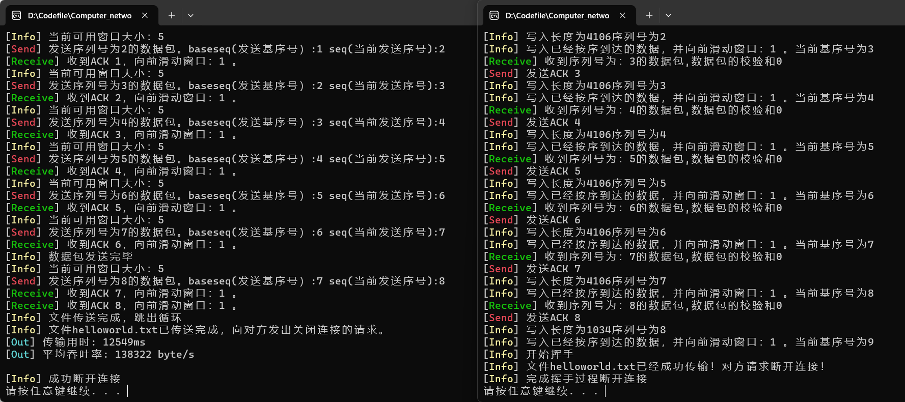
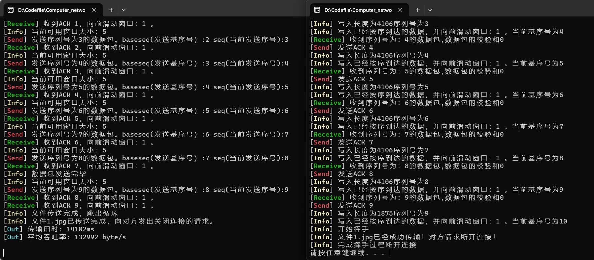
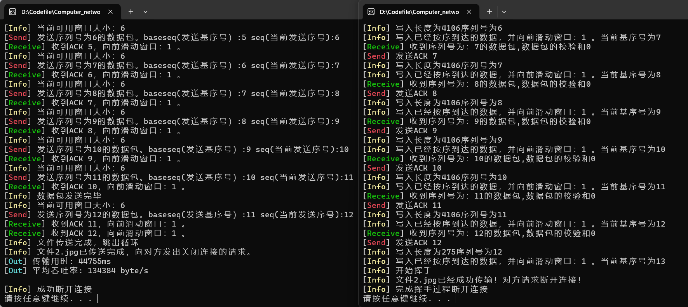
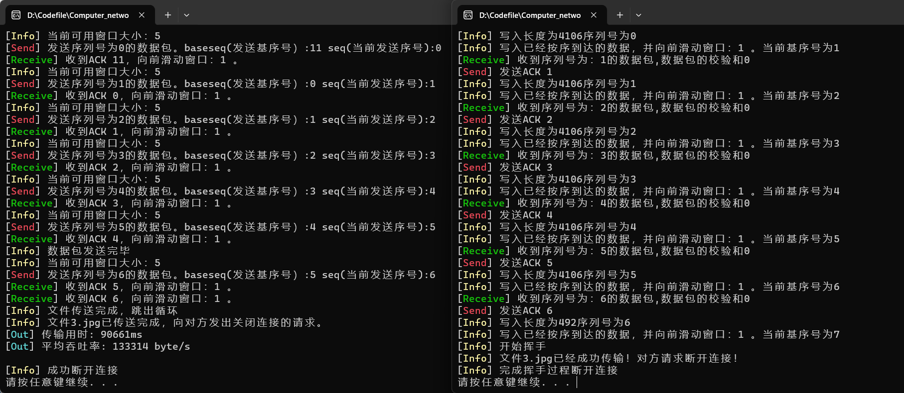
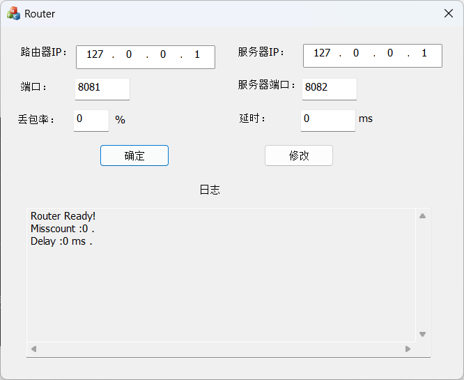
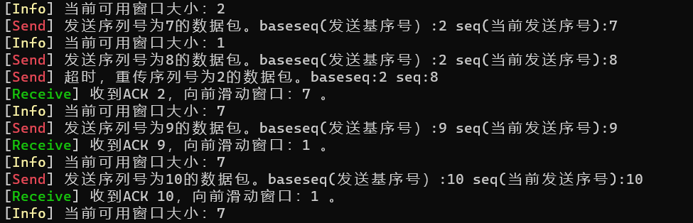
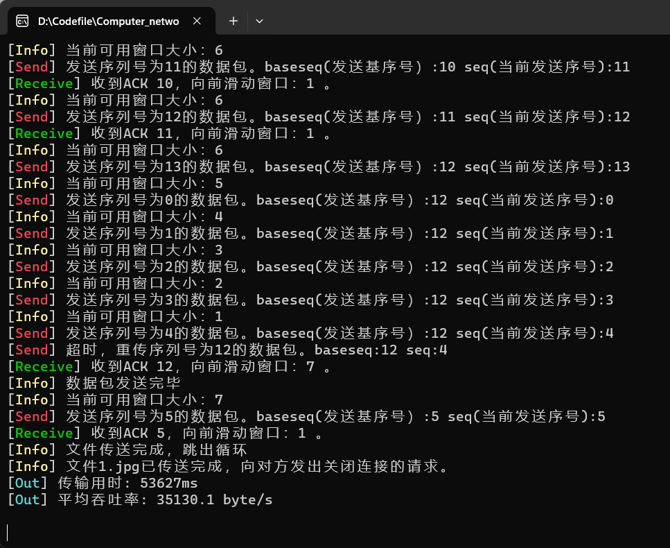
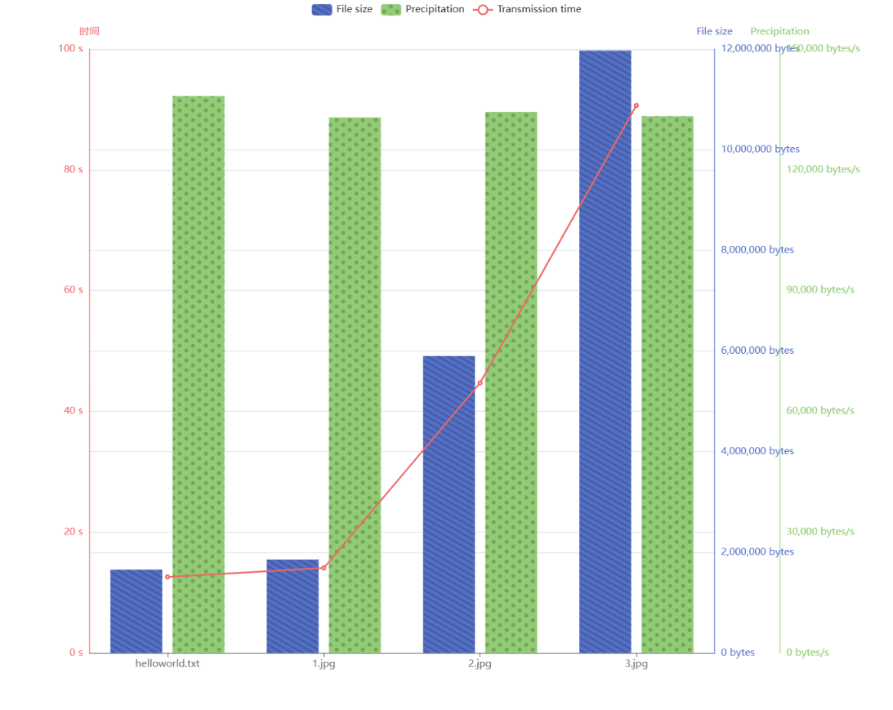

# 计算机网络实验报告

<center>Lab3-3 基于UDP服务设计可靠传输协议并编程实现</center>

<center>网络空间安全学院 物联网工程</center>

<center>2110951 梁晓储</center>

代码已发布到github：https://github.com/WangshuXC/Computer_network

## 一、实验要求

1. 实现单向数据传输（一端发数据，一端返回确认）。

2. 对于每个任务要求给出详细的协议设计。

3. 完成给定测试文件的传输，显示传输时间和平均吞吐率。

4. 性能测试指标：吞吐率、延时，给出图形结果并进行分析。

5. 完成详细的实验报告（每个任务完成一份，主要包含自己的协议设计、实现方法、遇到的问题、实验结果，不要抄写太多的背景知识）。

6. 编写的程序应该结构清晰，具有较好的可读性。

7. 提交程序源码、可执行文件和实验报告。

8. 在实验3-1的基础上，将停等机制改成基于滑动窗口的流量控制机制，发送窗口和接收窗口采用相同大小，支持选择确认，完成给定测试文件的传输。


## 二、协议设计和实验流程

### Header协议设计

设置数据报头部内容:

```c++
void setPacketHead(char* Buf) {
	Buf[0] = 0;//seq
	Buf[1] = 0;//seq
	Buf[2] = 0;//ack
	Buf[3] = 0;//ack
	Buf[4] = 0;//ACK
	Buf[5] = 0;//SYN/FIN
	Buf[6] = 0;//长度
	Buf[7] = 0;//长度
	Buf[8] = 0;//校验和
	Buf[9] = 0;//校验和
}

```

#### SR功能设计

##### 发送方

手动输入窗口大小`windowSize`，设置序号空间`seqSize`为固定值64。

切分数据包传输，循环读取文件中大小为`p_size-10`的数据，如果当前的发送窗口内有可用还未 
发送的序号，就发送该数据包,   记录发送数据包的时间。
超过`Timeout`，已发送的数据包还没有接收到   ACK，就重传该分组，重启定时器。
接收ACK，ACK对应的序号在窗口范围空间内，设定一个数组用来记录每个序号的数据包接收ACK 
的情况，ACK对应的序号的这个数据包被标记位已接收；如果恰好为 `base_seq`, 即窗口中最小的 
未被确认的序号，窗口向前滑动到最小的未收到ACK的序号。期间设定了一个最大的时间阈值， 
如果距离上一次接收到接收端的 ACK 已经超过了这个时间阈值，则认为接收端失联了。

##### 接收端

接收端独立确认每个正确接收的分组，向客户端发送 ACK，将接收到的数据包分组缓存，直到接 
收到的序号为接收窗口的 `base_seq`，这时查找连续的接收到的分组一起交付给上层，即凭借缓 
存的数据，写文件，同时窗口向前滑动到最小的未接收到的序号数据包。


### 实验流程

1.   **三次握手建立连接：**
     - 发送端发送第一次握手（SYN）。
     - 接收端接收第一次握手，并发送第二次握手（ACK）。
     - 发送端接收第二次握手，并发送第三次握手（ACK_SYN）。
2.   **文件数据传输：**
     - 发送端发送文件数据，按照发送、检测超时（重传）、滑动窗口、接收ack的顺序进行文件发送。
     - 接收端接收文件数据，按照缓存数据包、校验检测、回复ack、进行选择确认、滑动窗口的顺序进行文件接收。
3.   **四次挥手断开连接：**
     - 接收端发送第一次挥手（FIN）。
     - 发送端接收第一次挥手，并发送第二次挥手（ACK）。
     - 接收端接收第二次挥手，并发送第三次挥手（ACK）。
     - 发送端接收第三次挥手，并发送第四次挥手（FIN_ACK）。


## 三、功能实现和代码分析

### 差错检测实现

差错校验是通过计算校验和来实现的。具体来说，校验和是在每个数据包的`HEADER`结构中计算得出的一个值，用于检测数据在传输过程中是否发生了错误或丢失。

在发送数据包之前，通过`send_package`函数将数据按照指定长度和顺序号组织成`HEADER`结构。然后，在计算校验和之前，先将校验和字段置为0。接下来，对`HEADER`结构中的所有成员变量（包括数据、数据长度、标志位和序列号）进行逐位异或（XOR）运算，最终得到校验和的值。将这个计算得到的校验和写入`HEADER`结构的校验和字段中。

当接收端收到数据包时，它会重新计算接收到的数据包的校验和。如果计算得到的校验和与接收到的数据包中的校验和相等，说明数据在传输过程中没有发生错误或丢失。如果两者不相等，则表示数据包可能存在差错，需要进行处理。

```cpp
//差错检测，计算校验和
u_short cal_checksum(u_short* buf, int count) {
	unsigned int sum = 0;
	for (int i = 0; i < count; i++) {
		sum += *buf++;
		sum = (sum >> 16) + (sum & 0xFFFF);

	}
	return (u_short)~(sum & 0xFFFF);
}

```


### 丢包处理

#### 发送端

```c++
//判断当前窗口内是否有需要重传的数据包
for (int i = 0; i < windowSize; i++) {
    //已经发送过某序号的数据包
    if (issend[(base_seq + i) % seqSize]) {
        if (isacked[(base_seq + i) % seqSize] == 0 && clock() - issend[(base_seq + i) % seqSize] > Timeout)
        {//进行重传
            int sseq = 0;
            sseq = ((u_char)buffer_resent[(base_seq + i) % seqSize % windowSize][0] << 8) + (u_char)buffer_resent[(base_seq + i) % seqSize % windowSize][1];
            int cchecks = 0;
            cchecks = ((u_char)buffer_resent[(base_seq + i) % seqSize % windowSize][8] << 8) + (u_char)buffer_resent[(base_seq + i) % seqSize % windowSize][9];
            cout << "[\033[1;31mSend\033[0m] 超时，重传序列号为" << sseq << "的数据包。";
            cout << "baseseq:" << base_seq << " seq:" << SR_seq << " ";
            cout << endl;
            sendto(client_socket, buffer_resent[(base_seq + i) % seqSize % windowSize], p_size, 0, (SOCKADDR*)&server_addr, sizeof(SOCKADDR));
            issend[(base_seq + i) % seqSize] = clock();
        }
    }
}
```

发送程序每发完一个包就检测一下窗口内是否有超时了需要重传的数据包。具体为判断该号数据包没收到接收端发送过来的ack而且clock的时间差大于设置的超时范围。

关于超时判断，在for循环中每个包都有一个计时器记录发送的时间（issend），将它与当前时间进行做差就能够判断是否超时，如果这个包超时了就重传这个包


#### 接收端

```c++
if ((SR_seq >= base_seq && SR_seq <= (base_seq + windowSize - 1)) || (SR_seq < base_seq && SR_seq <= (base_seq + windowSize - 1) % seqSize)) {
    int i = 0;
    while (true_data[(base_seq + i) % windowSize]) {
        fwrite(recvbuffer[(base_seq + i) % windowSize] + 10, 1, true_data[(base_seq + i) % windowSize] - 10, f);
        ZeroMemory(recvbuffer[(base_seq + i) % windowSize], true_data[(base_seq + i) % windowSize]);
        cout << "[\033[1;33mInfo\033[0m] 写入长度为" << true_data[(base_seq + i) % windowSize] << "序列号为" << (base_seq + i) % seqSize << endl;
        true_data[(base_seq + i) % windowSize] = 0;
        i++;
    }
    base_seq = (base_seq + i) % seqSize;
    cout << "[\033[1;33mInfo\033[0m] 写入已经按序到达的数据，并向前滑动窗口：" << i << " 。" << "当前基序号为" << base_seq << endl;
}
else {
    cout << endl;
    sendto(server_socket, sendBuf_file, 10, 0, (SOCKADDR*)&client_addr, length);
    continue;
}
```

如果接收到正确的seq就按照正常逻辑进行窗口滑动和写入，如果收到了窗口以外的seq包，就会将这个seq的ack返回给发送端以防止死锁


### 发送窗口

发送文件名、三次握手、四次挥手流程与之前相同，不再赘述。

传输数据时，首先检查seq是否在窗口范围内，对窗口内的数据包，读入数据包内容，设置header的长度、seq、ack、校验和等字段。

设置header后发送数据包，更新时间，清空发送缓冲区等待下次发送。

```c++
//传输的序号在窗口范围之内,seq+1从0开始
if (((((SR_seq + 1) % seqSize) >= base_seq) && (SR_seq + 1) % seqSize < base_seq + windowSize) || (((SR_seq + 1) % seqSize) < base_seq && (SR_seq + 1) % seqSize < (base_seq + windowSize) % seqSize)) {
    if ((count = fread(buffer, 1, p_size - 10, f)) > 0) {
        all += count + 10;//数据加前面的头部大小
        //从0开始
        SR_seq = (SR_seq + 1) % seqSize;
        ZeroMemory(buffer_resent[SR_seq % windowSize], p_size);
        setPacketHead(buffer_resent[SR_seq % windowSize]);//设置报头部分
        //设置数据报
        for (int i = 0; i < count; i++) {
            buffer_resent[SR_seq % windowSize][i + 10] = (u_char)buffer[i];
        }
        //保存长度
        buffer_resent[SR_seq % windowSize][6] = count >> 8;
        buffer_resent[SR_seq % windowSize][7] = count & 0xFF;
        //保存序列号
        buffer_resent[SR_seq % windowSize][0] = (u_char)(SR_seq >> 8);
        buffer_resent[SR_seq % windowSize][1] = (u_char)(SR_seq & 0xFF);
        //如果之后还有包，将下一个包的序列号保存在ack
        //ack从1开始
        ack = SR_seq + 1;
        //最后一个包ack设置为0
        if (count < 4096) {
            cout << "数据包发送完毕" << endl;
            ack = 0;
        }
        buffer_resent[SR_seq % windowSize][2] = (u_char)(ack >> 8);
        buffer_resent[SR_seq % windowSize][3] = (u_char)(ack & 0xFF);
        //将数据包两位两位拼接进行校验
        u_short* buf = new u_short[p_size / 2 + 1];
        memset(buf, 0, p_size / 2 + 1);
        int i;
        for (i = 0; i < 10 + count; i += 2) {
            buf[i / 2] = ((u_char)buffer_resent[SR_seq % windowSize][i] << 8);
            if ((i + 1) < 10 + count) {
                buf[i / 2] += (u_char)buffer_resent[SR_seq % windowSize][i + 1];
            }
        }
        u_short checks = cal_checksum(buf, i / 2);
        //将校验和字段保存
        buffer_resent[SR_seq % windowSize][8] = checks >> 8;//校验和
        buffer_resent[SR_seq % windowSize][9] = checks & 0xFF;//校验和
        if (SR_seq < base_seq) {
            cout << "当前可用窗口大小：" << (base_seq + windowSize) % seqSize - SR_seq << endl;
        }
        else cout << "当前可用窗口大小：" << (base_seq + windowSize) - SR_seq << endl;
        //发送数据报
        sendto(client_socket, buffer_resent[SR_seq % windowSize], p_size, 0, (SOCKADDR*)&server_addr, sizeof(SOCKADDR));
        Sleep(20);
        issend[SR_seq] = clock();
        //清空buf,准备下一次接收文件中的数据
        memset(buffer, 0, sizeof(char) * 4096);
        cout << "<---  发送序列号为" << SR_seq << "、校验和为" << checks << "、长度为" << count + 10 << "的数据包。";
        cout << "baseseq(发送基序号）:" << base_seq << " seq(当前发送序号):" << SR_seq << " \n";
    }
}
```

每发完一个包，都检查窗口中是否有包超时，并重传这些包。

```c++
//判断当前窗口内是否有需要重传的数据包
for (int i = 0; i < windowSize; i++) {
    //已经发送过某序号的数据包
    if (issend[(base_seq + i) % seqSize]) {
        //该号数据包分组没有收到服务器端发来的ACK并且超时需要重传
        if (isacked[(base_seq + i) % seqSize] == 0 && clock() - issend[(base_seq + i) % seqSize] > Timeout)
        {	//重传数据包
            int sseq = 0;
            sseq = ((u_char)buffer_resent[(base_seq + i) % seqSize % windowSize][0] << 8) + (u_char)buffer_resent[(base_seq + i) % seqSize % windowSize][1];
            int cchecks = 0;
            cchecks = ((u_char)buffer_resent[(base_seq + i) % seqSize % windowSize][8] << 8) + (u_char)buffer_resent[(base_seq + i) % seqSize % windowSize][9];
            cout << "<---  超时，重传序列号为" << sseq << "、校验和为" << cchecks << "、长度为" << count + 80 << "的数据包。";
            cout << "baseseq:" << base_seq << " seq:" << SR_seq << " ";
            cout << endl;
            sendto(client_socket, buffer_resent[(base_seq + i) % seqSize % windowSize], p_size, 0, (SOCKADDR*)&server_addr, sizeof(SOCKADDR));
            issend[(base_seq + i) % seqSize] = clock();
        }
    }
}
```

接收到服务端数据`receive_buf_file`后，提取header中的seq和ack，在`isacked`数组标记该条数据发送成功。

若该数据的seq恰为滑动窗口的左沿，则向前计数已经成功发送且序号连续的包的数量，根据计数对窗口进行滑动。ack为0时，代表文件已经传输完毕。

若收到窗口之外的seq号，直接丢弃。

```c++
int rev = recvfrom(client_socket, receive_buf_file, 10, 0, (SOCKADDR*)&server_addr, &length);
if (rev > 0) {
    if (receive_buf_file[4] == 1) {//接收到了ACK
        last_ack = clock();
        int recvseq = ((u_char)receive_buf_file[0] << 8) + (u_char)receive_buf_file[1];
        int  aack = ((u_char)receive_buf_file[2] << 8) + (u_char)receive_buf_file[3];
        if ((recvseq >= base_seq && recvseq <= (base_seq + windowSize - 1)) || (recvseq < base_seq && recvseq <= (base_seq + windowSize - 1) % seqSize))
        {
            //收到在当前窗口范围内的ACK
            isacked[recvseq] = 1;
            issend[recvseq] = 0;
            //如果收到的恰好为发送基序号的ACK，就滑动窗口
            if (recvseq == base_seq) {
                int i = 0;//记录可以滑动窗口的大小
                //因为之前乱序接收到的ACK也缓存下来了
                while (isacked[(base_seq + i) % seqSize]) {
                    isacked[(base_seq + i) % seqSize] = 0;//滑动之后就将这一位置0
                    i++;
                }
                //得到当前新的发送基序号
                base_seq = (base_seq + i) % seqSize;
                cout << "  --->收到ACK" << recvseq << "，是当前等待被确认的数据包的最小序列号，向前滑动窗口：" << i << " 。" << endl;
            }
            if (aack == 0) {
                //所有文件都已经传送完成了并且接收到了ACK；
                cout << "文件传送完成，跳出循环" << endl;
                break;
            }
            continue;
        }
    }
    else {
        //无效数据包不做处理
        continue;
    }
}
else {
    //无效数据包不做处理
    continue;
}
```

### 接收窗口

接收到数据报后提取header中信息，计算校验和。

```c++
SR_seq = ((u_char)receiveBuf_file[0] << 8) + (u_char)receiveBuf_file[1];
true_data_len = 10 + ((u_char)receiveBuf_file[6] << 8) + (u_char)receiveBuf_file[7];
//将接收到的数据缓存到recvbuffer
memcpy(recvbuffer[SR_seq % windowSize], receiveBuf_file, true_data_len);//缓存数据
true_data[SR_seq % windowSize] = true_data_len;
cout << "收到序列号为：" << SR_seq << "的数据包" << endl;
setPacketHead(sendBuf_file);
u_short* buf = new u_short[p_size / 2 + 1];
memset(buf, 0, p_size / 2 + 1);
//获取数据的长度，数据报的序列号和下一个序列号
int length_file = ((u_char)receiveBuf_file[6] << 8) + (u_char)receiveBuf_file[7];
ack = ((u_char)receiveBuf_file[2] << 8) + (u_char)receiveBuf_file[3];
//计算校验和
int i;
for (i = 0; i < length_file + 10; i += 2) {
				buf[i / 2] = ((u_char)receiveBuf_file[i] << 8);
				if ((i + 1) < length_file + 10) {
								buf[i / 2] += (u_char)receiveBuf_file[i + 1];
				}
}
u_short checks = cal_checksum(buf, i / 2);
```

校验和错误则直接丢弃，等待超时重传。正确则在true_data[seq]处记录数据长度，同时作为收到该序号文件的标记。

收到数据后，从滑动窗口左沿开始计数已到达且序号连续的包，依次写入文件，并按照计数对窗口进行滑动。


```c++
//回复的数据包的seq和ack和接受来的一样
sendBuf_file[0] = receiveBuf_file[0];
sendBuf_file[1] = receiveBuf_file[1];
sendBuf_file[2] = receiveBuf_file[2];
sendBuf_file[3] = receiveBuf_file[3];
sendBuf_file[4] = 0;//ACK
sendBuf_file[8] = checks >> 8;//校验和
sendBuf_file[9] = checks & 0xFF;//校验和
cout << "收到的数据包的校验和" << checks << endl;
if (checks == 0) {
    sendBuf_file[4] = 1;//ACK确认接收到了文件
    sendto(server_socket, sendBuf_file, 10, 0, (SOCKADDR*)&client_addr, length);
    now = clock();
    cout << "<---  发送ACK" << SR_seq;
    if ((SR_seq >= base_seq && SR_seq <= (base_seq + windowSize - 1)) || (SR_seq < base_seq && SR_seq <= (base_seq + windowSize - 1) % seqSize)) {
        int i = 0;
        //从基序号开始读取所有已经按序号到达的数据,从基序号开始
        //得到了需要的序列号，写文件滑动窗口
        while (true_data[(base_seq + i) % windowSize]) {
            fwrite(recvbuffer[(base_seq + i) % windowSize] + 10, 1, true_data[(base_seq + i) % windowSize] - 10, f);//写文件
            ZeroMemory(recvbuffer[(base_seq + i) % windowSize], true_data[(base_seq + i) % windowSize]);
            cout << "(写入长度为" << true_data[(base_seq + i) % windowSize] << "序列号为" << (base_seq + i) % seqSize << ")";
            //写入之后就清零
            true_data[(base_seq + i) % windowSize] = 0;
            i++;
        }
        base_seq = (base_seq + i) % seqSize;
        cout << "，写入已经按序到达的数据，并向前滑动窗口：" << i << " 。" << "当前基序号为" << base_seq << endl;
    }
    else {
        cout << endl;
    }
}
```

### 计算传输时间和吞吐率

```c++
int all_time = clock() - whole_time;
cout << "[\033[1;36mOut\033[0m] 传输用时: " << all_time << "ms" << endl;
cout << "[\033[1;36mOut\033[0m] 平均吞吐率: " << double(all) / double(all_time / 1000) << " byte/s \n\n";
```


## 实验结果展示

### 发送成功截图









### 路由器设置



### 丢包后实现超时重传



### 输出传输时间和吞吐率



## 性能测试指标

对三个文件进行传输测试（未经过路由,未设置丢包,窗口大小设置为6）

|     文件名     |   文件大小   | 传输时间 |     吞吐率      |
| :------------: | :----------: | :------: | :-------------: |
| helloworld.txt | 1655808byte  | 12.583s  | 138322.32byte/s |
|     1.jpg      | 1857353byte  | 14.078s  | 132992.04byte/s |
|     2.jpg      | 5898505byte  | 44.713s  | 134384.94byte/s |
|     3.jpg      | 11968994byte | 90.661s  | 133314.70byte/s |

图表结果如下



