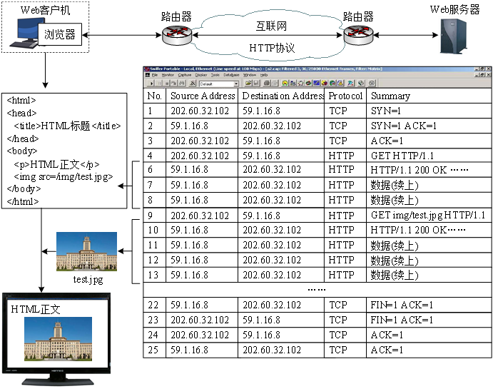
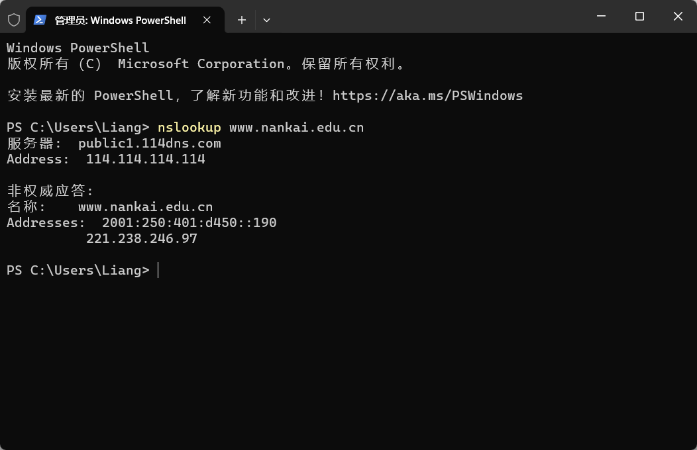

# 第1次书面作业

## 习题一（50分）

> 网络结构如下图所示，主机A与主机B之间通过3段链路和2台转发设备（R1与R2）进行连接，每条链路的长度和传输速率在图中标出，R1与R2采用存储转发机制，主机A向主机B发送一个长度为6000字节的报文。设电磁波传播速度为2×10^8米/秒，忽略报文在R1与R2中路由决策与排队的延时。请回答以下3个问题：
>
> 1. 如果采用报文交换，请计算报文传输的最小端到端延时（从主机A传输报文第一位开始，到主机B接收到报文最后一位为止所用的时间）（15分）
>
> 2. 如果将报文分成4个分组依次传输，请计算完成报文传输的最小端到端延时（忽略报文封装成分组的开销）（15分）
>
> 3. 在统计多路复用机制中，端到端延时具有不确定性，请简要分析影响端到端延时的主要因素（20分）
>
> 

1. (6000×8)/(100×10^6) + 1000/(2×10^8) + (6000×8)/10^9 + (20×10^3)/(2×10^8) + (6000×8)/(100×10^6) + (0.5×10^3)/(2×10^8) = 1.1155 ms
2. 分个分组含6000×8/4=12000bits, 12000/(100×10^6) + (20 + 1 +0.5)×10^3/(2×10^8) + (12000×5)/10^9 + (12000×5)/(100×10^6) = 0.8875ms

3. ①最主要因素是存储转发的排队时延；②路由决策与差错检测的时延；③分组的数量、大小以及数据流数量的影响；④不同路径上链路长度，传输速率的影响

## 习题二

> 浏览器访问Web服务器的报文交互过程如下图所示。请回答以下4个问题：
>
> 1. 浏览器与Web服务器所在主机的IP地址分别是什么？（8分）
>
> 2. 报文1～3的整体用途是什么？每个报文的具体用途？（8分）
>
> 3. 图中哪些报文是HTTP请求报文？每个报文的具体用途？（8分）
>
> 4. 使用Windows命令行模式提供的nslookup命令查询www.nankai.edu.cn的IP地址，给出结果截图，并对返回的结果进行解释。（26分）
>
> 

1.  浏览器：`202.60.32.102` 服务器：`59.1.16.8`

2. 用途是实现了三次握手，报文1的SYN=1表示客户端请求连接，报文2的SYN=1 ACK=1表示服务端同意建立连接，报文3ACK=1表示客户端收到了回复

3. 报文4和9，报文4是获取HTML页面，报文9是获取页面中的静态资源

4. 见下图

   

- `nslookup www.nankai.edu.cn`：这是执行的`nslookup`命令，用于查询域名的IP地址。
- `服务器: public1.114dns.com`：这是DNS服务器的名称或IP地址，指定用于进行DNS查询的服务器。在这里，使用的DNS服务器是`public1.114dns.com`。
- `Address: 114.114.114.114`：这是DNS服务器的IP地址。
- `非权威应答:`：这表示返回的DNS查询结果是非权威应答，即DNS服务器不是域名的官方授权服务器。
- `名称: www.nankai.edu.cn`：这是查询的域名，即`www.nankai.edu.cn`。
- `Addresses: 2001:250:401:d450::190`：这是查询到的域名对应的IPv6地址，即`www.nankai.edu.cn`的IPv6地址为`2001:250:401:d450::190`。
- `221.238.246.97`：这是查询到的域名对应的IPv4地址，即`www.nankai.edu.cn`的IPv4地址为`221.238.246.97`。
